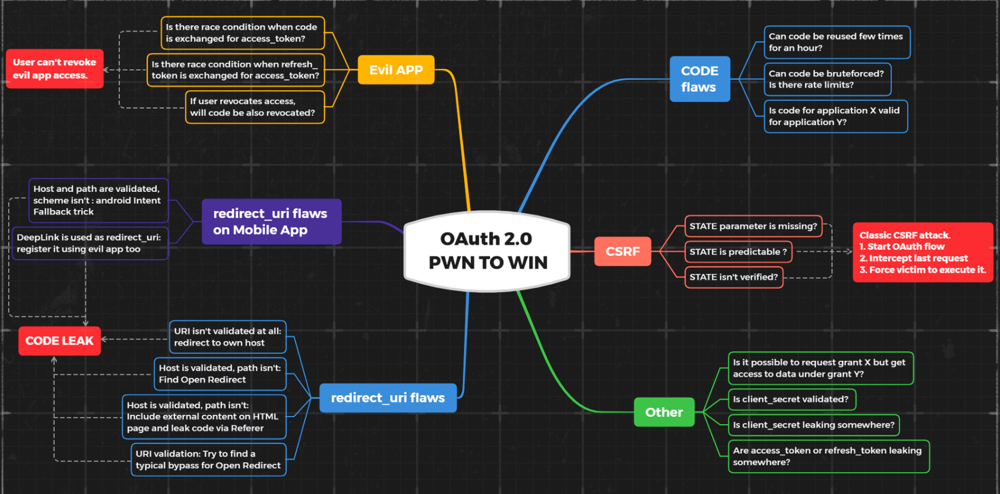

# **OAuth 2.0 授权框架**

## **什么是 OAuth？**

大家或许都遇到过这种情况，在登录某个社交媒体时，可以使用已有的第三方账号进行授权登录，而用户通过第三方账号授权登录后，账号相关信息和授权账号信息一致，如昵称头像手机号等信息，无需重新填写，给账号登录提供了极大的便利性。

而这种登录实现方式就是OAuth （Open Authorization），是目前非常流行的开放授权框架，它允许第三方应用程序请求访问用户在另一个应用程序上的帐户资源，例如访问电子邮件联系人列表，更关键的是 OAuth 虽然允许用户授权第三方应用程序访问权限，但只是有限的资源访问权限，而不是将其帐户的完全控制权交给第三方。

需要注意，OAuth2.0虽然是OAuth协议的延续版本，但是并不兼容OAuth1.0，OAuth1.0目前基本废弃，目前所说的OAuth基本为OAuth2.0。

## **OAuth 的基本了解**

主要可以理解为角色、授权范围和授权类型。首先在OAuth中，主要有三类角色相互交互工作，分别为：

- 客户端**应用程序：**需要访问用户（资源所有者）数据的第三方应用程序。
- **资源所有者：**第三方应用程序想要访问资源的用户。
- **OAuth服务提供商：**存储用户（资源所有者）的资源信息，可以向第三方应用程序提供用户相关信息的服务方。

然后是OAuth 授权范围，第三方应用程序必须指定要访问的数据以及会对数据的执行的操作类型，它使用客户端应用程序发送到OAuth服务的授权请求中的`scope`参数来完成此操作。

对于OAuth来说，客户端应用程序可以请求访问的范围对于每个OAuth服务都是唯一的。由于范围的名称只是任意文本字符串，因此格式可能因提供者而异。有些甚至使用完整的URI作为范围名称，类似于REST API端点。例如，当请求访问用户联系人列表时，根据所使用的OAuth服务，范围名称可能采用以下任一形式：

```
scope=contacts
scope=contacts.read
scope=contact-list-r
scope=https://oauth-authorization-server.com/auth/scopes/user/contacts.readonly

```

但是，当OAuth用于身份验证时，通常会使用标准化的OpenID Connect范围。例如，范围`openid profile`将允许客户端应用程序读取有关用户的基本信息，例如电子邮件地址、用户名、手机啊哈哦等。

最后是OAuth 授权类型，OAuth认证流程可以用不同的方式进行实现，而组成的认证流程可以被称为OAuth流或者OAuth授权类型，不同的授权类型具有不同程度的复杂性和安全性，需要结合当前的业务需求应用。

# **OAuth 授权类型**

根据官方标准，OAuth 2.0 共用四种授权类型：

- ****授权码模式（authorization code）：****用在服务端应用之间，是 OAuth2.0中最标准、应用最广泛的授权模式，主要用用户授权的code换取access token
- **隐藏模式（Implicit）**：主要用于移动端或者小程序端，用户在平台方授权页面登录后，直接在URL中带access token。
- ****资源所有者密码凭证模式（Resource Owner Password Credentials）：****这通常用在用户对客户端高度信任的情况下，比如客户端是操作系统的一部分，直接用用户名和密码获取Access Token
- **客户端凭证模式（Client Credentials）：主要用**于在命令行下请求令牌。

而OAuth主要可以总结的认证步骤如下：

1. 第三方应用程序请求访问用户数据，指定要使用的授权类型以及想要的访问权限。
2. 用户同意并授权所请求的访问权限。
3. 第三方应用程序收到访问令牌，证明已经得到用户授权，允许访问所请求的数据。
4. 第三方应用程序使用此访问令牌从资源服务器调用API，并获取用户的相关数据。

## **授权码模式**

授权码模式是是 OAuth2.0中最标准，应用最广泛的授权模式。这类授权模式非常适合于具备服务端的应用，当然现在大多数 APP 都有自己的服务端，所以大部分 APP 的 OAuth 授权都可以采取授权码模式，授权码模式的步骤如下：

**1. 客户端发出授权请求**

客户端应用程序向OAuth服务的api发出请求，要求访问某个用户的数据。

```
GET /authorization?client_id=12345&redirect_uri=https://client-app.com/callback&response_type=code&scope=openid%20profile&state=ae13d489bd00e3c24 HTTP/1.1
Host: oauth-authorization-server.com
```

**2. 用户同意并授权**

当授权服务器收到客户端应用程序的初始请求时，它将重定向用户到登录页面，并提示用户登录OAuth提供商的帐户并请求授权客户端应用程序需要访问的数据`scope`，用户可以选择同意或拒绝。

**3. 返回授权Code**

如果用户同意所请求的访问权限，则用户浏览器会重定向到指定的redirect_uri的`/callback`端点，其中包含了授权Code

```
GET /callback?code=a1b2c3d4e5f6g7h8&state=ae13d489bd00e3c24 HTTP/1.1
Host: client-app.com
```

**4. 请求访问令牌**

客户端应用程序收到授权Code后，则会在后端想OAuth服务端的/token发出POST请求，要求申请访问令牌（Access Token）

```
POST /token HTTP/1.1
Host: oauth-authorization-server.com
…
client_id=12345&client_secret=SECRET&redirect_uri=https://client-app.com/callback&grant_type=authorization_code&code=a1b2c3d4e5f6g7h8
```

**5. 获取访问令牌**

OAuth服务将验证获取访问令牌的请求，通过则服务端的响应包含应用程序所请求范围的访问令牌（Access Token）

```
{
    "access_token": "z0y9x8w7v6u5",
    "token_type": "Bearer",
    "expires_in": 3600,
    "scope": "openid profile",
    …
}

```

**6. API调用**

客户端应用程序通过访问令牌（Access Token）从资源服务器获取用户的数据，通常 访问令牌包含在`Authorization：Bearer`请求头中

```
GET /userinfo HTTP/1.1
Host: oauth-resource-server.com
Authorization: Bearer z0y9x8w7v6u5

```

**7. 获取资源**

资源服务器验证令牌是否有效，以及是否属于当前客户端应用程序。 如果是，它将根据访问令牌的范围发送所请求的资源（即用户数据）来响应。

```
{
    "username":"carlos",
    "email":"carlos@carlos-montoya.net",
    …
}

```

客户端应用程序现在可以使用此数据进行其预期用途。 在OAuth身份验证的情况下，它通常用作ID以授权用户认证会话，有效地将其登录。

由于申请令牌等操作都是在后端进行的，并不是通过浏览器发送的，因此此授权类型是最安全的。服务器端应用程序应尽可能使用此授权类型。

## **隐式授权模式**

隐式授权类型则要简单得多。 客户端应用程序在用户给出同意后立即接收访问令牌，所有通信都通过浏览器重定向完成，不存在像授权码授权类型中那样的安全后端通信。

隐式授权类型更适合单页应用程序和本机桌面应用程序，它们无法将`client_secret`存储在后端，因此不能使用授权码授权类型。

**1. 授权请求**

和授权码方式开始请求，唯一的主要区别是`response_type`参数必须设置为`token`。

```
GET /authorization?client_id=12345&redirect_uri=https://client-app.com/callback&response_type=token&scope=openid%20profile&state=ae13d489bd00e3c24 HTTP/1.1
Host: oauth-authorization-server.com
```

**2. 用户登录和同意**

用户登录并决定是否同意所请求的权限。这个过程与授权码流完全相同。

**3. 获取访问令牌（Access Token）**

如果用户同意所请求的访问权限，这里就开始有所不同了。OAuth服务将重定向用户的浏览器到授权请求中指定的`redirect_uri`。但不会发送包含授权码的查询参数，它会将访问令牌和其他相关数据拼接到URL中发回。客户端应用程序必须使用合适的脚本来提取片段并存储它。

```
GET /callback#access_token=z0y9x8w7v6u5&token_type=Bearer&expires_in=5000&scope=openid%20profile&state=ae13d489bd00e3c24 HTTP/1.1
Host: client-app.com
```

**4. API调用**

客户端应用程序成功从URL片段中提取访问令牌后，可以使用它来调用OAuth服务的`/userinfo`端点。与授权码流不同，这也是通过浏览器完成的。

```
GET /userinfo HTTP/1.1
Host: oauth-resource-server.com
Authorization: Bearer z0y9x8w7v6u5
```

**5. 资源授权**

资源服务器会验证令牌是否有效，如果通过则返回与访问令牌关联范围的用户数据。

```
{
    "username":"carlos",
    "email":"carlos@carlos-montoya.net"
}
```

这意味着敏感的访问令牌（Access Token）和用户数据更容易受到攻击。

# **OAuth身份验证缺陷**

尽管最初不是为此目的而设计的，但OAuth已经演变成一种用于用户身份验证的方式，因此在安全方面需要更为重视。但是OAuth缺乏内置安全措施需要开发自我实现安全措施，而在场景复杂化的情况下，开发或者应用方可能错误的使用OAuth，从而导致出现安全漏洞，攻击者针对常见薄弱点就可能攻击成功，对用户隐私造成巨大威胁。

主要可能会出现风险的地方为户端应用程序实现OAuth的过程，和OAuth服务本身配置这两块：

- 客户端应用程序中的漏洞
    - **隐式授权类型的实现缺陷**
    - **CSRF防护存在缺陷**
- OAuth服务中的漏洞
    - **授权代码和访问令牌泄露**
    - **范围验证存在缺陷**
    - **未经验证的用户注册**

## **OAuth客户端应用程序中的漏洞**

### **隐式授权类型的实现缺陷**

隐式授权的特点是授权验证时只需要client_id和redirect_uri这两个参数作应用标识，而返回的时候直接在uri片段中返回access token令牌，所以隐式授权应用场景就是无服务器参与的纯前端交互，如浏览器插件、各种网站挂件。但是由于隐式授权类型的设计缺陷，攻击者可通过精心设计如下攻击方式：

1、由于缺失了双secret的签名，api仅凭Access Token基本难以分辨应用请求来源，攻击者只需要找到一个xss，无需知道app secret，就很容易xss获取到access token，然后以此攻击受害者的平台方账号

2、同上，api无法分清应用请求来源，那么只要掌握了A应用中受害者的access token，并且在B应用中的某些关键请求步骤中替换掉，那么就有可能顺利登录到B应用的受害者应用方账号。

3、应用冒充，攻击者只使client_id（即应用appkey）和redirect_uri基本属于公开信息用就能冒充成其它应用调出授权页面，获取到的access token可以用于控制受害者的平台方账号。如果是高权限client_id，获取到的access token显然更有破坏力

### **CSRF防护存在缺陷**

尽管在OAuth流程中有许多可选参数，但是如果安全意识不高则很可能忽略state参数，从而导致出现CSRF漏洞。首先来了解下常见的OAuth绑定账号流程：

1、用户在第三方业务平台点击账号绑定，此时浏览器生成请求

```php
GET /authorization?client_id=12345&redirect_uri=https://client-app.com/callback&response_type=code&scope=openid%20profile HTTP/1.1
Host: oauth-authorization-server.com
```

2、用户同意授权，并跳转至redirect_uri 参数：

```php
GET /callback?code=a1b2c3d4e5f6g7h8 HTTP/1.1
Host: client-app.com
```

3、后端传输令牌，最终获取相关数据，完成绑定

注意在第二步中只有code参数没有state参数，如果攻击者提前生成访问请求，并通过CSRF诱使用户带有code的参数绑定攻击者的账号，那么就可能导致账号接管漏洞。`state`参数理想情况下应该包含一个无法猜测的值，而如果授权请求没有发送`state`参数，攻击者就可以在对用户进行攻击，通过将受害用户的帐户绑定到自己的社交媒体帐户来劫持客户端应用程序上的受害者用户帐户。

## OAuth服务中的漏洞

### 授权代码和访问令牌泄露

当Code和令牌通过用户的浏览器发送到授权请求中指定的`redirect_uri`参数的`/callback时`，如果OAuth服务未能正确验证`redirect_uri`参数的合法性，则攻击者就可能窃取到其用户账户关联的授权代码或访问令牌。

该攻击方式主要结合redirect_uri未指定授权目录引发用户劫持攻击。攻击者通过登录某种社交网络服务，修改链接redirect_uri参数值指向，将伪造后的用户授权链接发给目标用户，当目标用户点击或被欺骗访问上述授权链接进行登陆后，攻击者即可通过referer获取用户授权，快速登录目标用户账号，还可登陆该账号绑定的其他网站信息，查看敏感信息或执行授权操作。在这种情况下，攻击者甚至不需要知道客户端密钥或生成的访问令牌。只要受害者与OAuth服务有一个有效的会话，客户端应用程序就会在攻击者的代表下完成代码/令牌交换，然后登录受害者的帐户。
除了开放重定向的攻击方式，其他一些可能存在风险，如：

1、处理查询参数和URL片段的危险JavaScript：例如使用postMessage进行令牌传输，攻击者可能会利用postMessage最终将令牌传递到外部域中

2、XSS跨站脚本：虽然 XSS 攻击本身可能会产生巨大的影响，但攻击者通常只有在用户关闭选项卡或导航离开之前的短时间内才能访问用户会话。由于 `HTTPOnly` 属性通常用于会话 cookie，因此攻击者通常也无法使用 XSS 直接访问它们。但是，通过窃取 OAuth 代码或令牌，攻击者可以在自己的浏览器中访问用户的帐户。这使他们有更多时间来探索用户的数据并执行有害操作，显着增加了 XSS 漏洞的严重程度。

3、HTML注入漏洞：在某些情况下，可能无法注入 JavaScript（例如，由于 CSP 约束或严格过滤），但仍然可以使用简单的 HTML 注入来窃取授权代码。如果可以将 `redirect_uri` 参数指向一个页面，在该页面上可以注入自己的 HTML 内容，则可能可以通过 `Referer` 标头泄露代码。例如，请考虑以下 `img` 元素：``。在尝试获取此图像时，某些浏览器（如 Firefox）将在请求的 `Referer` 标头中发送完整的 URL，包括查询字符串。

### **有缺陷的 redirect_uri 验证**

最佳实践是当客户端应用程序在 OAuth 服务中注册时提供其真实回调 URI 的白名单。这样，当 OAuth 服务收到新请求时，它可以根据此白名单验证`redirect_uri`参数。在这种情况下，提供外部 URI 可能会导致错误。然而，仍然可能有方法绕过此验证。

在审核 OAuth 流时，可以尝试`redirect_uri`参数以了解它是如何被验证的。例如：

- 有些实现允许一系列子目录，只需检查字符串是否以正确的字符序列开始，即批准的域。可以尝试删除或添加任意路径、查询参数和片段，看看可以更改什么而不触发错误。
- 如果可以附加额外的值到默认的`redirect_uri`参数，可能能够利用 OAuth 服务的不同组件解析 URI 之间的差异。例如，可以尝试以下技术:`https://default-host.com &@foo.evil-user.net#@bar.evil-user.net/`
- 有时可能会遇到服务器端参数污染漏洞。以防万一，应该尝试提交重复的`redirect_uri`参数，如下所示:`https://oauth-authorization-server.com/?client_id=123&redirect_uri=client-app.com/callback&redirect_uri=evil-user.net`
- 有些服务器也会对`localhost` URI 进行特殊处理，因为它们经常在开发过程中使用。在某些情况下，任何以`localhost`开头的重定向 URI 可能会意外地允许在生产环境中。这可能允许通过注册域名，如`localhost.evil-user.net`来绕过验证。

重要的是，不应该将测试局限于探测`redirect_uri`参数。在测试时，通常需要尝试不同参数的不同组合。有时更改一个参数可能会影响其他参数的验证。例如，将`response_mode`从`query`更改为`fragment`有时可以完全改变`redirect_uri`的解析，从而允许提交本来会被阻止的 URI。同样，如果注意到支持`web_message`响应模式，这通常允许在`redirect_uri`中使用更广泛的子域。

### **通过代理页面窃取代码和访问令牌**

有时可能会发现无论尝试什么，都无法成功提交外部域作为`redirect_uri`。

到这个阶段，应该已经相对了解哪些 URI 部分是可以篡改的。现在关键是利用这些知识尝试访问客户端应用程序本身更广泛的攻击面。换句话说，尝试确定是否可以更改`redirect_uri`参数以指向白名单域上的任何其他页面。

尝试找到可以成功访问不同子域或路径的方法。例如，默认 URI 通常会在 OAuth 特定路径上，如`/oauth/callback`，这不太可能具有任何有趣的子目录。然而，可能可以使用目录遍历技巧来提供域上的任意路径。像这样的东西：

```
<https://client-app.com/oauth/callback/../../example/path>
```

可以在后端被解释为：

```
<https://client-app.com/example/path>
```

一旦确定了能够设置为重定向 URI 的其他页面，应该对它们进行检查，以寻找可能用来泄露代码或令牌的其他漏洞。对于[授权码流程](https://portswigger.net/web-security/oauth/grant-types#authorization-code-grant-type)，需要找到一个漏洞，使能够访问查询参数，而对于[隐式授权类型](https://portswigger.net/web-security/oauth/grant-types#implicit-grant-type)，需要提取 URL 片段。

对于这个目的最有用的漏洞之一是开放重定向。可以将其用作代理，将受害者以及他们的代码或令牌转发到攻击者控制的域，可以在其中托管任何恶意脚本。

注意，对于隐式授权类型，窃取访问令牌不仅能够在客户端应用程序上登录受害者的帐户。由于整个隐式流程是通过浏览器进行的，因此还可以使用令牌向 OAuth 服务的资源服务器发出自己的 API 调用。这可能会获取敏感的用户数据，无法从客户端应用程序的 Web UI 中访问。

### **数据范围验证存在缺陷**

在OAuth流程中，用户必须根据授权请求中定义的范围批准所请求的访问权限。生成的令牌允许客户端应用程序仅访问用户批准的范围。

但由于OAuth服务的某些验证缺陷，攻击者可能会将访问令牌升级为具有额外权限的访问令牌。

**作用域升级：授权码流程**

对于授权码授权类型，用户的数据通过安全的服务器到服务器通信请求和发送，第三方攻击者通常无法直接操纵。但是攻击者仍然可以通过在OAuth服务中注册自己的客户端应用程序来实现相同的结果。

例如，假设攻击者的恶意客户端应用程序最初使用`openid email`范围请求访问用户的电子邮件地址。在用户批准此请求后，恶意客户端应用程序将收到授权码。由于攻击者控制他们的客户端应用程序，因此可以将另一个`scope`参数添加到代码/令牌交换请求中，其中包含附加的`profile`范围：

```
POST /token
Host: oauth-authorization-server.com
…
client_id=12345&client_secret=SECRET&redirect_uri=https://client-app.com/callback&grant_type=authorization_code&code=a1b2c3d4e5f6g7h8&scope=openid%20 email%20profile
```

如果服务器不根据初始授权请求中的作用域验证此操作，它有时会使用新的范围生成访问令牌并将其发送给攻击者的客户端应用程序：

```
{
    "access_token": "z0y9x8w7v6u5",
    "token_type": "Bearer",
    "expires_in": 3600,
    "scope": "openid email profile",
    …
}
```

攻击者随后可以使用他们的应用程序进行必要的API调用以访问用户的配置文件数据。

**作用域（Scope）升级：隐式流程**

对于隐式授权类型，访问令牌是通过浏览器发送的，这意味着攻击者可以窃取与无辜客户端应用程序相关联的令牌并直接使用它们。一旦攻击者窃取了访问令牌，他们可以通过浏览器发送普通的基于请求OAuth服务的请求，同时在此过程中手动添加新的`scope`参数。

理想情况下，OAuth服务应该根据生成令牌时使用的`scope`值验证此操作，但并非总是如此。只要调整后的权限不超过此客户端应用程序先前授予的访问级别，攻击者就可以在不需要进一步获得用户批准的情况下访问其他数据。

用户利用前文的各种攻击手段，直接获取了access_token，直接在`scope`添加新的数据范围，OAuth服务应该根据生成令牌时值来验证此作用域值，但实际是只要调整后的权限不超过以前授予此客户端应用程序的访问级别，攻击者就有可能访问其他数据，而无需用户的进一步批准。

### **未经验证的用户注册**

在通过OAuth对用户进行身份验证时，客户端应用程序不会验证OAuth提供程序存储的信息是否正确的，包括有时甚至不验证他们的电子邮件地址。攻击者可以利用这一点，使用相同的详细信息在OAuth提供程序中注册一个新的帐户，但是内容会填写已有用户的内容，由于OAuth对内容验证不够全面，此账户信息与目标用户的账户信息基本一致，客户端默认为目标用户登录，导致攻击者可以使用新注册的账号直接登录目标账号，

# 防止OAuth认证漏洞

OpenID Connect可以很好地适应普通的OAuth流程。从客户端应用程序的角度来看，主要区别在于存在一个附加的、标准化的作用域集，这些作用域对于所有提供者都是相同的，并且有一个额外的响应类型：`id_token`。

### **OpenID Connect的角色**

OpenID Connect的角色与标准OAuth的角色基本相同。主要区别在于规范使用稍微不同的术语。

- **Relying party** - 请求用户身份验证的应用程序。这与OAuth客户端应用程序是同义词。
- **End user** - 被验证的用户。这与OAuth资源所有者是同义词。
- **OpenID provider** - 配置为支持OpenID Connect的OAuth服务。

### **OpenID Connect的声明和作用域**

术语“claims”是指代表资源服务器上有关用户的信息的`key:value`对。一个声明的示例可能是`“family_name”：“Montoya”`。

与基本的OAuth不同，其作用域对于每个提供者都是唯一的，而所有OpenID Connect服务使用相同的作用域集。为了使用OpenID Connect，客户端应用程序必须在授权请求中指定作用域`openid`。然后，它们可以包含一个或多个其他标准作用域：

- `profile`
- `email`
- `address`
- `phone`

这些作用域中的每一个对应于关于用户的一些声明的读取权限，这些声明在OpenID规范中被定义。例如，请求作用域`openid profile`将授予客户端应用程序读取有关用户身份的一系列声明的访问权限，例如`family_name`、`given_name`、`birth_date`等。

OpenID Connect 提供的另一个主要功能是 `id_token` 响应类型。它返回一个使用 JSON Web Signature (JWS) 签名的 JSON Web Token (JWT)。JWT 负载中包含一个基于最初请求的范围的声明列表。它还包含有关用户上次通过 OAuth 服务进行身份验证的信息。客户端应用程序可以使用此信息来决定用户是否已经得到了足够的身份验证。

使用 `id_token` 的主要好处是客户端应用程序和 OAuth 服务之间需要发送的请求数量减少了，这可以提供更好的性能。用户成功进行身份验证后，包含此数据的 ID 令牌立即发送到客户端应用程序，而无需获取访问令牌并单独请求用户数据。

与基本的 OAuth 不同，ID 令牌中传输的数据的完整性不仅仅是依靠一个受信任的通道，而是基于 JWT 加密签名。因此，使用 ID 令牌可以帮助防止某些中间人攻击。但是，由于签名验证的加密密钥也通过同一网络通道传输（通常是在 /.well-known/jwks.json 上公开），因此仍然可能存在某些攻击。

请注意，OAuth 支持多个响应类型，因此客户端应用程序可以向授权请求中同时发送基本的 OAuth 响应类型和 OpenID Connect 的 `id_token` 响应类型：

## **识别OpenID Connect**

如果客户端应用程序正在积极使用OpenID Connect，则应从授权请求中明显。检查的最可靠方法是查找强制使用的`openid`范围。

即使登录过程最初似乎没有使用OpenID Connect，仍然值得检查OAuth服务是否支持它。可以尝试添加`openid`范围或将响应类型更改为`id_token`，并观察是否会导致错误。

与基本OAuth一样，查看OAuth提供者的文档以查看其OpenID Connect支持是否有用也是一个好主意。还可以从标准端点`/.well-known/openid-configuration`访问配置文件。

## **OpenID Connect漏洞**

OpenID Connect的规范比基本OAuth严格得多，这意味着通常具有明显漏洞的古怪实现的潜力较小。话虽如此，因为它只是OAuth上的一层，所以客户端应用程序或OAuth服务仍可能容易受到我们之前研究的一些基于OAuth的攻击的影响。

OpenID规范概述了一种标准化的方式，允许客户端应用程序向OpenID提供程序注册。如果支持动态客户端注册，客户端应用程序可以通过向专用的`/registration`端点发送`POST`请求来注册自己。这个端点的名称通常在配置文件和文档中提供。

在请求正文中，客户端应用程序以JSON格式提交关于自身的关键信息。例如，通常需要包括一个白名单重定向URI的数组。它还可以提交一系列附加信息，例如他们想要公开的端点的名称、应用程序的名称等等。一个典型的注册请求可能看起来像这样：

为了防止[OAuth认证漏洞](https://portswigger.net/web-security/oauth)，OAuth提供者和客户端应用程序都必须实施强有力的关键输入验证，特别是`redirect_uri`参数。 OAuth规范本身几乎没有内置保护，因此开发人员必须自己使OAuth流程尽可能安全。

重要的是要注意，客户端应用程序和OAuth服务本身都可能出现漏洞。

## **对于OAuth服务提供商**

- 要求客户端应用程序注册有效的`redirect_uris`白名单。尽可能使用严格的字节对字节比较来验证传入请求中的URI。只允许完整匹配，而不是使用模糊匹配。这可以防止攻击者访问白名单域上的其他页面。
- 强制使用`state`参数。其值也应该通过包含一些不可猜测的，会话特定数据（例如包含会话cookie的哈希）来绑定到用户的会话。这有助于保护用户免受类似CSRF的攻击。它也使得攻击者更难使用任何被盗的授权码。
- 在资源服务器上，请确保验证访问令牌是否是发送给相同`client_id`的请求。还应该检查所请求的范围，以确保其与最初授权的范围匹配。

## **对于OAuth客户端应用程序**

- 在实施之前，确保完全理解OAuth的细节。许多漏洞是由于对每个阶段到底发生了什么以及如何可能被利用的简单缺乏理解而导致的。
- 即使不是强制性的，也要使用`state`参数。
- 不仅将`redirect_uri`参数发送到`/authorization`端点，还要将其发送到`/token`端点。
- 在开发移动或本地桌面OAuth客户端应用程序时，通常无法保持`client_secret`私有。在这些情况下，可以使用`PKCE`（`RFC 7636`）机制来提供额外的保护，以防止访问代码拦截或泄漏。
- 如果使用[OpenID](https://portswigger.net/web-security/oauth/openid) Connect `id_token`，请确保根据JSON Web Signature，JSON Web Encryption和OpenID规范进行适当的验证。
- 小心使用授权码 - 它们可能会通过加载外部图像，脚本或CSS内容时的`Referer`标头泄漏。还要注意不要将它们包含在动态生成的JavaScript文件中，因为它们可能会通过`<script>`标签从外部域执行。

# 参考资料

## OAuth_Bug



<aside>
💡 备注

**恶意应用程序**

用户无法撤销恶意应用程序访问权限

当code换取access token时，是否存在竞争条件？

当刷新令牌换取访问令牌时，是否存在竞争条件？

如果用户撤销访问权限，Code是否也会被撤销？

**移动应用程序上的重定向URI缺陷**

主机和路径是否被验证

DeepLink用作重定向URI：也使用恶意应用程序注册它。

**重定向URI缺陷**

URI根本没有被验证：重定向到自己的主机

主机被验证，路径没有：查找开放重定向

主机被验证，路径没有：在HTML页面上包含外部内容并通过Referer泄漏代码

URI验证：尝试找到开放重定向的典型绕过

**Code缺陷**

Code是否可以在几个小时内重复使用？

Code是否可以被暴力破解？是否有速率限制？

应用程序A的Coded是否对应用程序B有效？

用户A的Code对用户B有效吗？

**CSRF**

STATE参数是否丢失？

STATE是否可预测？

STATE是否被验证？

**经典CSRF攻击**

启动OAuth流程

拦截最后一个请求

强制受害者执行它

**其他**

是否有可能请求授权X，但获得授权Y下的数据访问权限？

client_secret是否被验证？

client_secret是否存在泄漏？

access_token或refresh_token是否存在泄漏？

</aside>

## OAuth2.0 CheckList


## OAuth2.0 PT CheatSheet

**重定向URL**

```bash
While Auth Process Intercept the Http Requests and see the and check the redriction
Parameter and play around for some time.
在Auth过程中拦截HTTP请求，查看并检查重定向参数，并花一些时间研究。
```

**oAuth 令牌劫持**

```bash
While Testing OPEN REDRICTION check if the tokens can be hijacked any how
在测试OPEN REDRICTION (开发重定向)时，检查令牌是否可以被某种方式被劫持。
```

**使用子域名绕过**

```bash
-if  redrict_url=http://example.com
-try redrict_url=http://evil.example.com
```

**使用后缀绕过**

```bash
-if  redrict_url=http://example.com
-Try redrict_url=http://example.com.nx
-Try redrict_url=http://example.com.in
-Try redrict_url=http://example.com.mx
```

目前很多安全研究员对OAuth 2.0 框架很有兴趣，主要在于OAuth2.0非常流行但容易报错，导致可能会出现很多漏洞，泄露诸多敏感用户信息，甚至可能完全绕过原有的身份验证机制

## **什么是OAuth授权类型？**

OAuth授权类型确定OAuth过程中涉及的详细步骤。

授权类型还会影响客户端应用程序在每个阶段与OAuth服务的通信方式，包括访问令牌本身的发送方式。因此，授权类型通常被称为“OAuth流”。

在客户端应用程序向OAuth服务发送初始授权请求之前，必须配置OAuth服务以支持特定的授权类型。客户端应用程序在其发送到OAuth服务的初始授权请求中指定要使用的授权类型。

有多种不同的授权类型，每种授权类型都具有不同程度的复杂性和安全性考虑。

## **OAuth 范围(Scopes)**

## **使用OpenID Connect扩展OAuth**

当用于身份验证时，OAuth通常会添加一个OpenID Connect层，该层提供了一些额外的功能，与识别和验证用户有关。

## **什么是OpenID Connect？**

OpenID Connect扩展了OAuth协议，提供了一个专用的身份验证层，位于基本OAuth实现之上。它添加了一些简单的功能，使OAuth的身份验证用例得到更好的支持。

OAuth最初并不是以身份验证为目的而设计的；它旨在成为应用程序之间委派特定资源的授权手段。然而，许多网站开始定制OAuth以用作身份验证机制。为了实现这一点，他们通常请求读取一些基本用户数据，并且如果被授权访问，则假定用户在OAuth提供者的一侧进行了身份验证。

这些简单的OAuth身份验证机制远非理想。首先，客户端应用程序无法知道用户何时、何地或如何进行身份验证。由于每个实现都是某种自定义解决方案，因此也没有请求用户数据以此目的的标准方式。为了正确支持OAuth，客户端应用程序必须为每个提供者配置单独的OAuth机制，每个机制都有不同的端点、唯一的作用域集等等。

OpenID Connect通过添加标准化的身份相关功能来解决这些问题，使OAuth通过身份验证以更可靠和统一的方式工作。

## **OpenID Connect是如何工作的？**

### **ID token（ID令牌）**

```
response_type=id_token token
response_type=id_token code
```

在这种情况下，ID令牌和访问令牌或代码将同时发送到客户端应用程序。

### **未受保护的动态客户端注册**

```
POST /openid/register HTTP/1.1
Content-Type: application/json
Accept: application/json
Host: oauth-authorization-server.com
Authorization: Bearer ab12cd34ef56gh89

{
    "application_type": "web",
    "redirect_uris": [
        "https://client-app.com/callback",
        "https://client-app.com/callback2"
        ],
    "client_name": "My Application",
    "logo_uri": "https://client-app.com/logo.png",
    "token_endpoint_auth_method": "client_secret_basic",
    "jwks_uri": "https://client-app.com/my_public_keys.jwks",
    "userinfo_encrypted_response_alg": "RSA1_5",
    "userinfo_encrypted_response_enc": "A128CBC-HS256",
    …
}
```

OpenID提供者应要求客户端应用程序进行身份验证。在上面的示例中，它们使用了HTTP承载令牌。但是，有些提供者将允许动态客户端注册而无需任何身份验证，这使攻击者能够注册自己的恶意客户端应用程序。这可能会产生各种后果，具体取决于这些攻击者可控属性的值如何使用。例如，可能已经注意到其中一些属性可以提供为URI。如果OpenID提供者访问了其中任何一个，除非有其他安全措施，否则可能会导致二次[SSRF](https://portswigger.net/web-security/ssrf)漏洞。

### **允许引用授权请求**

到目前为止，我们已经查看了通过查询字符串提交授权请求所需参数的标准方式。一些OpenID提供程序会提供另一种选项，即可以将这些参数作为JSON Web Token（JWT）传递。如果支持此功能，则可以发送一个指向包含其余OAuth参数及其值的JSON Web Token的单个`request_uri`参数。根据OAuth服务的配置，此`request_uri`参数是另一个可能的SSRF向量。

也可能能够使用此功能来绕过这些参数值的验证。一些服务器可能会有效地验证授权请求中的查询字符串，但可能未能充分应用相同的验证到JWT中的参数，包括`redirect_uri`。

要检查此选项是否受支持，应查找配置文件和文档中的`request_uri_parameter_supported`选项。或者，可以尝试添加`request_uri`参数，看看是否有效。会发现，即使一些服务器没有在文档中明确提到此功能，它们也支持此功能。

---